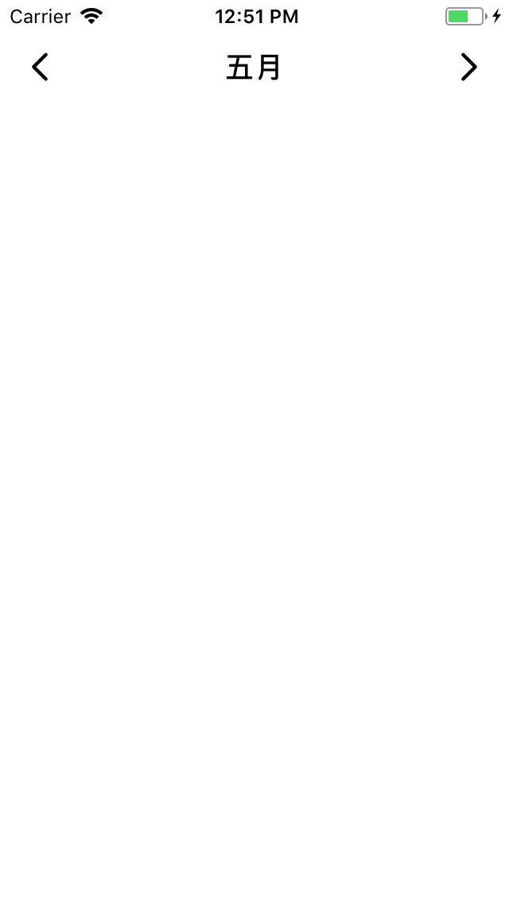

# CYHeaderSwitchView

A reusable *Left and Right Switch View*

### General

This view is used to show the different date more ofen now, like *week day* or *month* eg.

### Preview



### How to use

#### First step

Drag the file in the directory called `Code` and the image in `Assets.xcassets` to project, and add the header file.

```objc
#import "CYHeaderSwitchView.h"
```

#### Second step

Init the view with frame, and assign  `delegate` to this view if you need it.(optionally)

```objc
CGFloat statusBarHeight = [[UIApplication sharedApplication] statusBarFrame].size.height;
CYHeaderSwitchView *headerView = [[CYHeaderSwitchView alloc] initWithFrame:CGRectMake(0, statusBarHeight, [UIScreen mainScreen].bounds.size.width, 44)];
[self.view addSubview:headerView];
```

And now, you just put the view above the bottom view, but it does not know how to show the content, read the content follow please.

#### Third step

Create the instance of class `CYHeaderCalculator`, assign the property called `minimalDate` and `maximalDate`.

```objc
CYHeaderCalculator *calculator = [CYHeaderCalculator calculatorWithType:CYCalculatorTypeMonth];
calculator.minimalDate = [NSDate dateWithTimeIntervalSinceNow:-3600 * 24 * 100];  // 100 days age
calculator.maximalDate = [NSDate dateWithTimeIntervalSinceNow:3600 * 24 * 100];   // 100 days after
```

#### Forth step

Set the instance of `CYHeaderCalculator` to the `header view`.

```objc
headerView.calculator = calculator;
```

#### What's more

Absolutely, if you prefer to show other contents rather than the date by default, you can subclass of the class `CYHeaderCalculator` and just override the follow methods:

```objc
- (NSUInteger)minimalIndex;
- (NSUInteger)maximalIndex;
- (NSUInteger)defaultIndex;
- (NSString *)currentTitleOfIndex:(NSUInteger)index;
```

*Thank you for supporting.*
